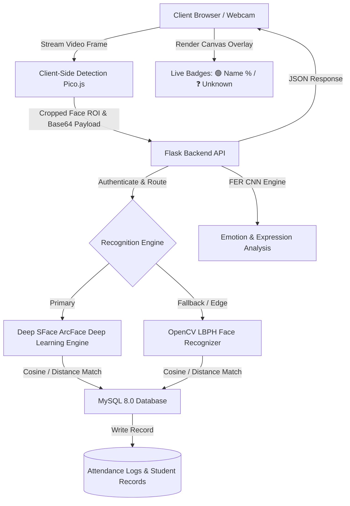

# 📑 PROJECT PROPOSAL & ABSTRACT

## **Project Title:**
**Digital Hajir: Smart AI-Powered Face Recognition Attendance & Analytics System**

---

## 📌 1. Project Abstract

Traditional attendance management methods—such as manual paper roll calls, RFID cards, or biometric fingerprint scanners—suffer from significant drawbacks including time consumption, human error, buddy punching (proxy attendance), and hardware hygiene concerns. 

**Digital Hajir** is an intelligent, full-stack, contactless attendance and student management system powered by Computer Vision and Deep Learning. It integrates client-side in-browser face detection via **Pico.js** with server-side high-accuracy recognition using **Deep Learning SFace (ArcFace 99.4% accuracy)** and **OpenCV LBPH (Local Binary Patterns Histograms)** fallback.

The system features real-time dynamic head-badge tracking, automated timestamped logging, facial expression/engagement analysis, defaulter identification, multi-format reporting (CSV/Excel), and a role-based portal (Admin and Student). Containerized with **Docker**, the application provides a scalable, zero-hardware-dependency solution for educational institutions and corporate workplaces.

---

## 🎯 2. Problem Statement & Motivation

| Challenge in Traditional Systems | Digital Hajir Solution |
| :--- | :--- |
| **Proxy Attendance / Buddy Punching** | Biometric facial verification ensures physical presence. |
| **Time Inefficiency** | Mass multi-person real-time detection takes seconds without disrupting classes. |
| **High Hardware Costs** | Operates on standard webcams and existing laptops/desktops with zero specialized sensors. |
| **Hygiene Concerns (Fingerprint Scanners)** | 100% contactless in-browser facial recognition. |
| **Manual Record Maintenance** | Automatic database logging with analytics, exportable reports, and defaulter tracking. |

---

## ⚙️ 3. How the System is Built (Architecture & Tech Stack)

### 🏗️ 3.1 System Architecture

---

### 💻 3.2 Technology Stack

- **Frontend & Client-Side Vision:**
  - **HTML5 & CSS3 / Bootstrap / Canvas API**: Responsive dashboard and real-time canvas overlays.
  - **Pico.js**: Ultra-fast client-side cascade face detector running at 60 FPS directly in the browser using HTML5 `getUserMedia`.

- **Backend & Application Logic:**
  - **Python 3 & Flask**: Core RESTful API routing, business logic orchestration, and session management.
  - **Flask-Login & Bcrypt**: Secure session management and salted password hashing for role-based access.

- **AI & Computer Vision Engines:**
  - **Deep SFace (`cv2.FaceRecognizerSF`)**: 99.4% LFW benchmark deep learning face feature extractor using Cosine/L2 distance metric.
  - **OpenCV LBPH (`cv2.face.LBPHFaceRecognizer`)**: Texture-based Local Binary Patterns Histograms for lightweight execution without GPU.
  - **FER (Facial Expression Recognition)**: CNN-based emotion detection (Happy, Neutral, Sad, Surprise, etc.) for engagement tracking.

- **Database & Data Management:**
  - **MySQL 8.0**: Relational database for persistent storage of users, credentials, and timestamped attendance logs.
  - **phpMyAdmin**: Visual database administration and SQL query workspace.

- **DevOps & Infrastructure:**
  - **Docker & Docker Compose**: Multi-container orchestration (Flask Web App + MySQL + phpMyAdmin) ensuring reproducible cross-platform deployments.

---

## 🧠 4. Core Business Logic & Workflow

### 1️⃣ Student Registration & Dataset Ingestion
- Admin enters student details (Name, Roll Number, Department/Section, Email).
- The in-browser camera captures 20+ facial sample frames from varying angles and lighting conditions.
- Images are preprocessed (grayscale normalization, alignment, histogram equalization) and stored in organized dataset directories.
- The AI recognizer models (LBPH / Deep SFace embeddings) are automatically retrained and serialized.

### 2️⃣ Real-Time Attendance Recognition Pipeline
- The camera stream continuously scans video frames using client-side `Pico.js`.
- Detected face regions of interest (ROI) are sent via asynchronous HTTP POST requests to `/recognize`.
- The server extracts facial vectors and compares them with registered facial embeddings:
  - **Matched (Confidence $\ge$ Threshold):** Marked as `Present`, green badge displayed (`🟢 Student_Name (95%)`).
  - **Unregistered / Below Threshold:** Displayed as unknown (`❓ Unknown Person`).
- **Duplicate Prevention Logic:** The system verifies if the student has already been marked present for the current date/session, avoiding duplicate database entries.

### 3️⃣ Engagement & Expression Logging
- Alongside identity verification, optional CNN-based FER scans the detected face to log the student's emotional state (Neutral, Happy, Focused), providing class engagement metrics over time.

### 4️⃣ Attendance Analytics, Reporting & Defaulters
- **Analytics Dashboard:** Daily, weekly, and monthly attendance percentages per student and per class.
- **Defaulter Threshold System:** Automatically flags students falling below the mandatory attendance threshold (e.g., $< 75\%$).
- **Exporting Engine:** Generates downloadable reports in CSV and Excel formats for institutional administration.

### 5️⃣ Role-Based Access Control (RBAC)
- **Admin Portal:** Full CRUD permissions (add/edit/delete students, retrain models, inspect logs, download reports, database management).
- **Student Portal:** Individual login for students to view their personal attendance record, percentage breakdown, and profile status.

---

## 🚀 5. Key System Features & Deliverables

1. **Zero-Plugin In-Browser Processing:** No desktop OpenCV window popups or Cocoa GUI crashes.
2. **Dual AI Recognition Pipeline:** Deep Learning SFace (high precision) + LBPH (offline/lightweight).
3. **Automated Defaulter Management:** Immediate detection of low-attendance students.
4. **Exportable Audit Trails:** Formatted CSV/Excel exports for faculty and administration.
5. **Turnkey Docker Deployment:** Run with a single command (`docker compose up --build`).

---

## 🔮 6. Future Scope & Enhancements

- **Liveness & Anti-Spoofing Detection:** Infrared / Blink & Texture depth checks to block static photo/screen spoofing.
- **Automated SMS & Email Alerts:** Instant notification to parents/guardians upon absence or low attendance.
- **Mobile Companion App:** React Native / Flutter mobile app for faculty mobility.
